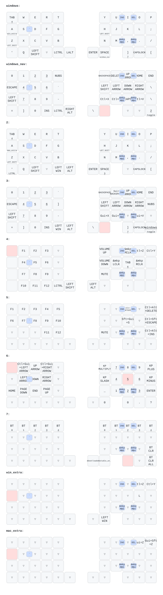

# zmk-config-LiNEA40

ZMK firmware configuration for the LiNEA40 split keyboard.

## Keymap

Auto-regenerated by [keymap-drawer](https://github.com/caksoylar/keymap-drawer) on every change to `config/**` (see [.github/workflows/keymap_drawer.yml](.github/workflows/keymap_drawer.yml)):

